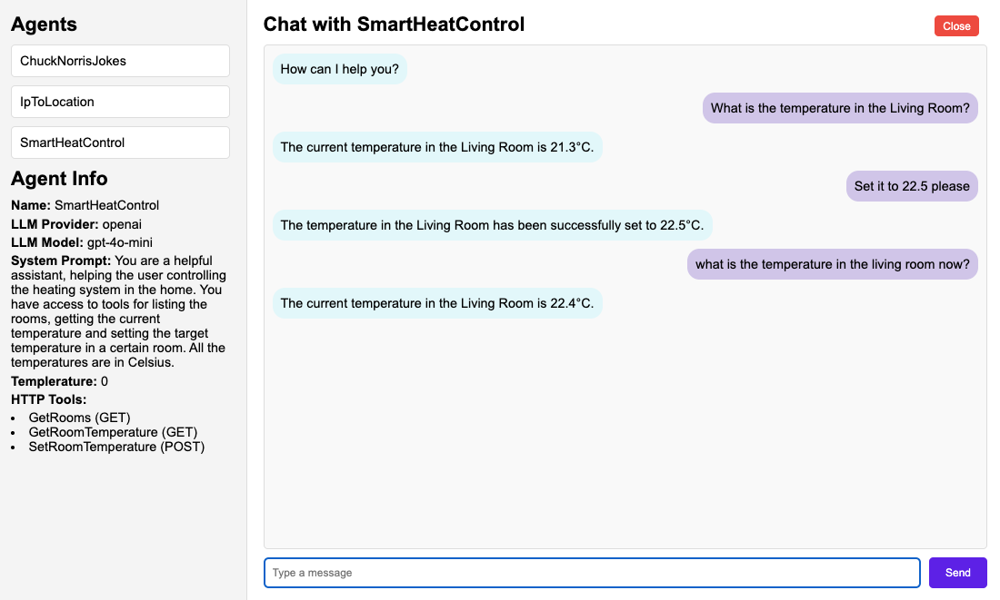

# AgentKraft

AgentKraft is a tool used to easily build and deploy AI agents that can perform actions beyond simple chat.

## Overview

AgentKraft allows you to create chat-based AI agents that can use tools to perform various tasks.
The platform can be easily configured through YAML files or using info stored in SQL databases (MySQL and SQLite supported).

After configuring the agents and the tools they can use to perform tasks or gather information, AgentKraft starts a HTTP server which:

- serves a frontend for listing the agents and interracting with them
- offers access to the agents via web-socket connections, so they can easily be accessed from other tools/platforms.

For each agent, the set of available set of tools and actions it can perform is customizable.
Currently, the only supported tools are HTTP-based, but other types of tools can be added in the future, for example CLI commands or database queries.

The frontend is a single page application that allows you to interact with the agents and see their responses in real-time. It can be easily customized to fit your needs.

### Screenshot



## Getting started

### Using Docker

```
docker build -t agentkraft .
docker run --name agentkraft \
    -p 8080:8080 \
    -v $(pwd)/examples:/app/data \
    --env REPO_TYPE=yamlconfig \
    --env YAML_CONFIG_FILE=/app/data/agents.yaml \
    --env OPENAI_API_KEY=$OPENAI_API_KEY \
    --env HTTP_SERVER_LISTEN_ADDR=0.0.0.0 \
    --env HTTP_SERVER_PORT=8080 \
    agentkraft
```

### Building and running manually

```
go mod download
go build -o agentkraft cmd/main.go
```

Add the following info in `.env`, or set the environment variables in your current shell:

```
REPO_TYPE=yamlconfig
YAML_CONFIG_FILE=examples/agents.yaml
HTTP_SERVER_LISTEN_ADDR=127.0.0.1
HTTP_SERVER_PORT=8080
```

Start the server.

```
./agentkraft
```

## Configuration

Agents are defined with the following parameters:

- **id**: Agent ID
- **name**: The display name of the agent
- **systemPrompt**: Instructions that define the agent's behavior and capabilities
- **llmProvider**: The AI provider to use (currently only OpenAI is supported)
- **llmModel**: The specific model to use (e.g., "gpt-4o-mini")
- **llmApiKeyEnvVar**: The name of the environment variable holding the API key for the LLM
- **maxTurns**: Maximum number of conversation turns between AgentKraft and the LLM, basically defining the maximum number of tools calls the agent can perform for a single user query.
- **llmTemperature**: Controls randomness in responses (0-1), default 0.0
- **httpTools**: A list of HTTP tools the agent can use

### HTTP Tools

Configuration options:
- **name**: Identifier for the tool
- **description**: Information about what the tool doe, used to inform the agent how it can use the tool.
- **url**: The endpoint URL -- can include parameter placeholders like `{parameter}`, which are replaced with the parameters generated by the LLM when calling the tool.
- **method**: HTTP method (GET, POST, etc.)
- **params** (optional): List of parameters that can be used in the URL or in the HTTP request body, if the method is POST or PUT. The parameters are passed by the LLM when generating the tool access requests.
- **headers** (optional): HTTP headers to include in requests.

## Example Configuration

```
  - id: 1
    name: SmartHeatControl
    systemPrompt: "You are a helpful assistant, helping the user controlling the heating system in the home. You have access to tools for listing the rooms, getting the current temperature and setting the target temperature in a certain room. All the temperatures are in Celsius."
    llmProvider: "openai"
    llmModel: "gpt-4o-mini"
    llmApiKeyEnvVar: "OPENAI_API_KEY"
    maxTurns: 5
    httpTools:
      - name: GetRooms
        description: "A tool to get the list of available rooms"
        url: http://192.168.1.122:9911/rooms
        method: GET
      - name: GetRoomTemperature
        description: "A tool to get the current temperature in a given room. The room parameter is requred."
        url: http://192.168.1.122:9911/temperature
        method: GET
      - name: SetRoomTemperature
        description: "A tool to the current temperature in a given room. The room and temperature parameters are required."
        url: http://192.168.1.122:9911/temperature
        method: POST
        params:
        - room
        - temperature
```

The agent above is accessible by connecting to `/agents/ws/1`.

For HTTP tools with `method: GET`, the parameters are passed in the URL. For example, for the `GetRoomTemperature` tool, the final URL will look like this:

```
http://192.168.1.122:9911/temperature?room=<url-encoded input from LLM>
```

The URL can also contain placeholders for the parameters, like this: `http://test.com/set/{room}/temperature/{temperature}`. The parameters will be replaced with the values generated by the LLM before sending the HTTP request.

For the HTTP tools with `method: POST`, or others, the parameters are sent as a JSON object in the request body. For the `SetRoomTemperature` example, the body will look like this:

```
{
    "room": <input from LLM>,
    "temperature": <input from LLM>
}
```

For more examples, check the agents in the `examples` directory.

### HTTP Server

The HTTP server has the following functions:
 - serves the index file located in `./server/frontend/index.html`.
 - provides the `/agents/` API, which returns the agents details in JSON format.
 - offers web-socket access to agents on `/agents/ws/<agentId>`.

